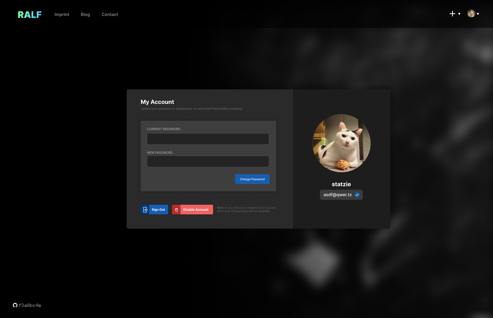
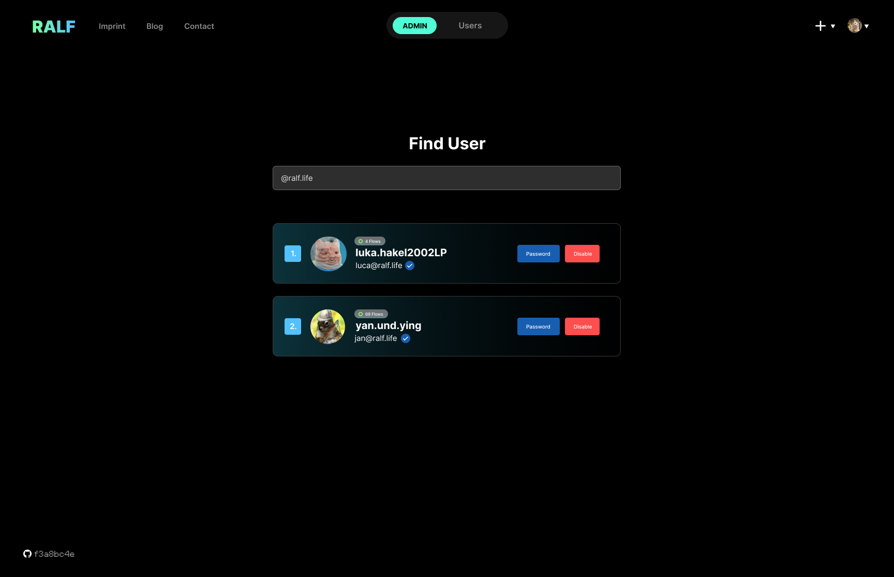
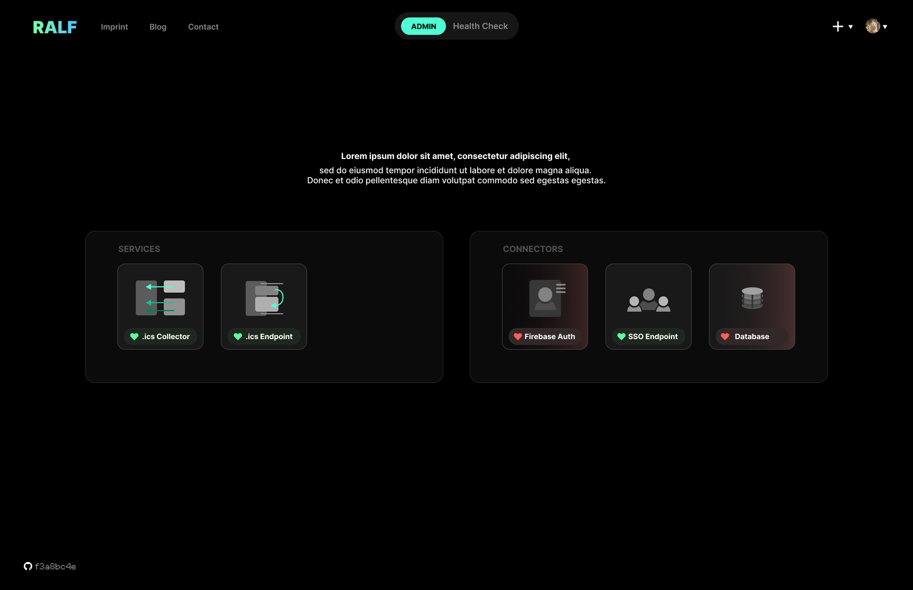
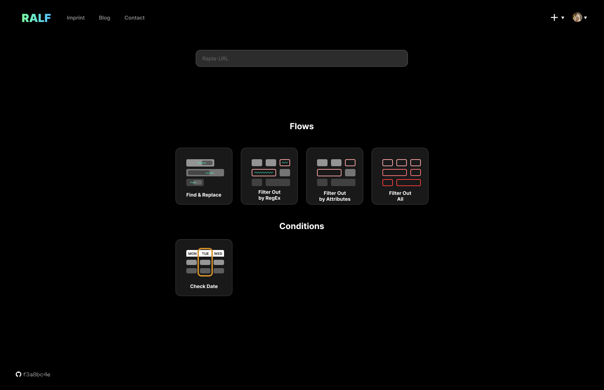

---

- [User Interaction](#user-interaction)
  * [Account Management](#account-management)
  * [Sign In, Sign Up, Sign Out](#sign-in--sign-up--sign-out)
- [RALF-Service](#ralf-service)
  * [Collect Information from Existing .ics Sources](#collect-information-from-existing-ics-sources)
  * [Provide .ics Endpoints with Filtered Output](#provide-ics-endpoints-with-filtered-output)
- [Administration](#administration)
  * [User Management](#user-management)
  * [Health Check](#health-check)
- [Flow Management](#flow-management)
  * [Create New Flow](#create-new-flow)

---

# User Interaction

## Account Management

### Brief description:

The user should be able to activate their account after initial registration, change the password and also reset the account password when the user forgets their password.

### GUI Mockup:

### Flow of Events

### Preconditions:

- The user needs an account.

### Postconditions:

- The user should have an activated account and a changed password.

### Effort Estimation:

|Story Points|Effort|
|---|---|
|8|2 weeks|

---

## Sign In, Sign Up, Sign Out

### Brief Description:

Simple button to Sign in, Sign out or Sign up. For the Sign up an E-Mail, username and password is required. The password needs to be typed in twice to stop typos. The username and password is required for the sign in or an SSO account. The sign out button stops the session.
Mock Up Login Page

### Special Requirement:

User Database or
Service to authenticate users (SSO, Firebase, Auth0, …)

### Preconditions:

- `Sign up` The user needs to have a valid email and have a password that meets the password policy.
- `Sign in` The user needs to have a valid account.

### Postconditions:

- `Sign up` The user should have a valid account and be logged in automatically.
- `Sign in` The user should be logged in with his account and access the main page.
- `Sign out` The user should be logged out of his account and be back on the home page.

### Effort Estimation:

|Story Points|Effort|
|---|---|
|13|2 weeks|

---

# RALF-Service

## Collect Information from Existing .ics Sources

### Short description:

A user should be able to enter a .ics source (e.g. by URL) and the program automatically collects needed data from the source.

### Preconditions:

- .ics source needs to be available. 

### Postconditions:

- Everything important from the .ics source should be available for our program. 

### Effort estimation:

|Story Points|Effort|
|---|---|
|21|2 weeks|

---

## Provide .ics Endpoints with Filtered Output

### Short description:

The data from the .ics sort is filtered or changed with the used flow and then send back to a .ics endpoint e.g. Google Calender

### Preconditions: 

- There is a .ics endpoint that is available. There needs to be configured flow that can be used and there needs to be data that can be send to the endpoint.

### Postconditions:

- The user is presented with an .ics endpoint that has the desired data in it.

### Effort Estimation:

|Story Points|Effort|
|---|---|
|21|2 weeks|

---

# Administration

## User Management

### Brief description:

The administrator should be able to view all existing accounts and change the permissions of them.

### GUI Mockup:

### Flow of Events

### Preconditions:

- There have to be different types of users.

### Postconditions:

- The administrator has different possibilities than a standard user.

### Effort Estimation:

|Story Points|Effort|
|---|---|
|8|1 week|

---

## Health Check

### Brief Description:

All connections to databases and services which do anything should be actively monitored. A health check is used to check, if the services are working and if connections are open.

### GUI Mockup:

### Preconditions:

- Services and databases are working and stable

### Postconditions:

- Ensure services and databases are running
- If health-checks fail, the administrators should be notified

### Effort Estimation:

|Story Points|Effort|
|---|---|
|5|1 week|

---

# Flow Management

## Create New Flow

### Short Description:

A user can enter an ICS and apply predefined flows (=> "Filterprofiles") to it. A flow is an action or rule that will be applied to the original .ics-Input. For example you use a flow to replace all occurences of "Theorethische Informatik" to "Theo".

### GUI Mockup:

### Flow of Events

### Preconditions:

- Have an ICS (or Rapla) that can be imported via URL

### Postconditions:

- The data from the ICS is correctly changed according to the specified filters

### Effort estimation

|Story Points|Effort|
|---|---|
|18|1 week|
